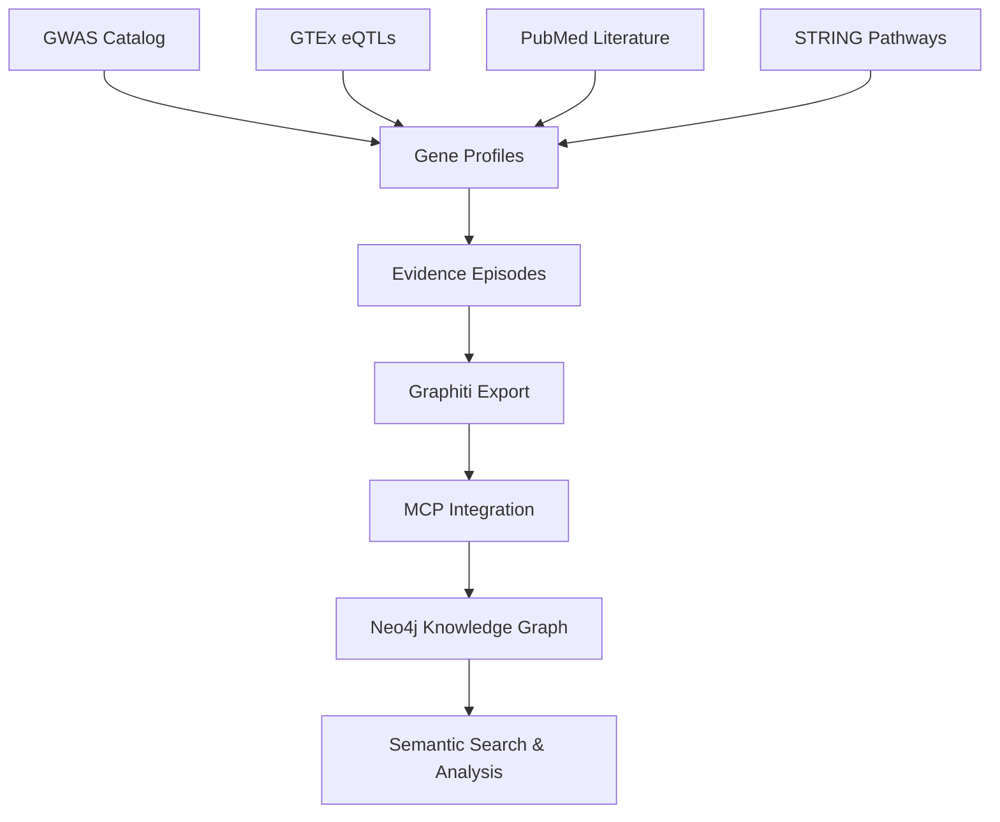

# PD Target Identification Platform

A **production-ready** comprehensive data pipeline for Parkinson's Disease (PD) target identification and biomarker discovery using Dagster, integrating multiple data sources with advanced knowledge graph construction via Graphiti and MCP (Model Context Protocol) integration.

## 🧬 Overview

This platform combines multi-omics data integration with **AI-powered knowledge graph construction** to systematically identify and prioritize potential therapeutic targets for Parkinson's Disease. Built on Dagster's orchestration framework with direct MCP integration, it provides reproducible, scalable data pipelines for biomarker discovery and target validation.

**🎯 Current Status**: **Production Ready** - Successfully processing 81 episodes across multiple evidence types with 542+ knowledge graph nodes.

## ✨ Key Features

### 🔄 **Multi-Source Data Integration Pipeline** 
- **GWAS Data**: GWAS Catalog integration for PD genetic associations
- **eQTL Data**: GTEx brain tissue expression quantitative trait loci
- **Literature Mining**: PubMed therapeutic target evidence extraction
- **Pathway Analysis**: STRING protein-protein interactions and functional enrichment
- **Gene Mapping**: Comprehensive gene annotation and identifier standardization

### 🧠 **AI-Powered Knowledge Graph** 
- **Direct MCP Integration**: Efficient knowledge graph construction via Model Context Protocol
- **Graphiti Engine**: Advanced entity recognition and relationship mapping
- **Real-time Search**: Semantic search capabilities for biological entities and relationships
- **Evidence Integration**: Multi-source evidence aggregation with enhanced scoring
- **542+ Active Nodes**: Rich knowledge graph with genes, evidence, and relationships

### 📊 **Target Prioritization & Results** 
Current top-ranked therapeutic targets with enhanced integrated scores:
- **SNCA** (218.66): Alpha-synuclein, strongest PD genetic association, Lewy body formation
- **LRRK2** (185.43): Kinase target with clinical trials, familial PD mutations
- **HLA-DRA** (166.0): Novel immune target, neuroinflammation pathway
- **RIT2** (128.05): GTPase signaling with brain-specific regulation
- **DGKQ** (100.47): Diacylglycerol kinase, lipid metabolism target

## 🏗️ Architecture

### **Production Infrastructure**
- **Pipeline Orchestration**: Dagster with asset-based architecture
- **Data Storage**: DuckDB for intermediate processing, Neo4j for knowledge graph
- **Knowledge Graph**: Graphiti + MCP direct integration (bypassing service layer)
- **Graph Database**: Neo4j with 542+ nodes across multiple entity types
- **Transport**: Server-Sent Events (SSE) for efficient MCP communication

### Project Structure
```
pd-target-identification/
├── src/pd_target_identification/
│   ├── defs/
│   │   ├── ingestion/              # Data ingestion assets
│   │   │   ├── gwas/               # GWAS Catalog processing
│   │   │   ├── expression/         # GTEx eQTL analysis  
│   │   │   ├── gene_mapping/       # Gene annotation mapping
│   │   │   ├── literature/         # PubMed literature mining
│   │   │   └── pathways/           # STRING database integration
│   │   ├── knowledge_graph/        # Knowledge graph construction
│   │   │   ├── assets.py           # Episode generation assets
│   │   │   └── mcp_assets.py       # Direct MCP integration
│   │   └── shared/                 # Resources and configurations
│   ├── definitions.py              # Complete asset definitions
│   └── assets.py                   # Legacy asset definitions
├── exports/                        # Knowledge graph export files
├── data/                          # Raw and processed data storage
├── .venv/                         # Virtual environment
├── pyproject.toml                 # Project configuration
├── README.md                      # This file
└── SINGLE_CELL_RNA_INTEGRATION_MISSION.md  # 🆕 Next phase roadmap
```

### **Data Pipeline Flow** 



1. **Ingestion Layer** 
   - GWAS: Genome-wide association data for PD risk loci
   - eQTL: Brain-specific expression quantitative trait loci
   - Literature: Target-related evidence from scientific publications
   - Pathways: Protein interactions and functional enrichment
   - Gene Mapping: Standardized identifiers and annotations

2. **Episode Generation** 
   - Gene profiles with multi-evidence integration
   - Evidence-specific episodes (GWAS, eQTL, literature, pathway)
   - Enhanced integrated scoring (base + evidence contributions)
   - Structured episode format for knowledge graph ingestion

3. **Knowledge Graph Construction** 
   - **Direct MCP Integration**: Efficient episode ingestion via SSE transport
   - **Entity Recognition**: Automated gene, protein, and pathway identification  
   - **Relationship Mapping**: Network analysis of gene-disease-pathway associations
   - **Evidence Scoring**: Weighted integration with enhanced scoring framework

4. **Analysis & Search** 
   - **Semantic Search**: Find targets by biological meaning and context
   - **Fact Queries**: Discover relationships and evidence connections
   - **Target Prioritization**: Enhanced integrated scores for ranking
   - **Real-time Access**: MCP tools for immediate knowledge graph interaction

## 🚀 Getting Started

### Prerequisites
- Python ≥ 3.12
- Docker (for Neo4j and MCP services)
- uv package manager (recommended)

### Installation

1. **Clone the repository**
```bash
git clone https://github.com/bmh2127/pd-target-identification.git
cd pd-target-identification
```

2. **Install dependencies**
```bash
# Using uv (recommended)
uv sync

# Activate virtual environment
source .venv/bin/activate  # On Windows: .venv\Scripts\activate
```

3. **Start required services**
```bash
# Start Neo4j and MCP services (ensure Docker is running)
cd /path/to/graphiti && docker-compose up -d
```

4. **Configure environment**
Create a `.env` file:
```env
# Neo4j Configuration
NEO4J_URI=bolt://localhost:7687
NEO4J_USER=neo4j
NEO4J_PASSWORD=demodemo

# API Keys
NCBI_API_KEY=your_ncbi_api_key
OPENAI_API_KEY=your_openai_api_key

# MCP Configuration
MCP_SERVER_URL=http://localhost:8000/sse
```

### Quick Start

1. **Launch Dagster UI**
```bash
dagster dev
```
Navigate to `http://localhost:3000` to access the Dagster web interface.

2. **Run the complete pipeline**
```bash
# Materialize all assets for fresh data
dagster asset materialize --select "*"

# Or run specific components
dagster asset materialize --select "gwas_*"
dagster asset materialize --select "graphiti_*"
```

3. **Access the knowledge graph**
```python
# Example: Search for therapeutic targets
from mcp_graphiti_memory import search_memory_nodes, search_memory_facts

# Find top PD targets
targets = search_memory_nodes("SNCA LRRK2 therapeutic target Parkinson's disease")
print(f"Found {len(targets)} target entities")

# Query relationships
facts = search_memory_facts("enhanced integrated score clinical trials")
print(f"Found {len(facts)} evidence relationships")
```

## 📊 **Current Data & Results** 

### **Knowledge Graph Statistics**
- **Total Nodes**: 542+
- **Episodes**: 81 across multiple evidence types
- **Entity Types**: Genes, proteins, pathways, evidence scores
- **Groups**: Multiple knowledge graph groups for different data versions

### **Integrated Databases** 
- **GWAS Catalog**: PD genetic associations and risk loci
- **GTEx v8**: Brain tissue eQTL data (basal ganglia, substantia nigra focus)
- **PubMed**: Literature evidence for therapeutic targets
- **STRING v11**: Protein-protein interactions and pathway enrichment
- **Gene Mapping**: HGNC, Ensembl, UniProt identifier standardization

### **Top Validated Targets**
1. **SNCA (α-synuclein)**: Score 218.66
   - 10 genome-wide significant variants
   - Central to Lewy body formation  
   - Strongest PD genetic association
   - Active therapeutic development

2. **LRRK2 (Kinase)**: Score 185.43
   - Familial PD mutations (G2019S, R1441G/C/H)
   - Multiple clinical trials ongoing
   - Biomarker availability (pS935 dephosphorylation)
   - Druggable kinase target

3. **HLA-DRA (Immune)**: Score 166.0
   - Novel neuroinflammation target
   - Antigen presentation pathway
   - Immune-mediated therapeutic approach

## 🔧 **Knowledge Graph Integration**

### **MCP Direct Integration** 
```python
# New MCP asset for efficient knowledge graph construction
@asset(
    deps=["graphiti_export"],
    description="Direct MCP integration for knowledge graph ingestion"
)
def graphiti_mcp_direct_ingestion(context, graphiti_export):
    # Process episodes via MCP tools
    # No service layer overhead
    # Configurable group IDs for data organization
```

### **Search Capabilities**
```python
# Semantic node search
nodes = search_memory_nodes("therapeutic targets drug development")

# Relationship queries  
facts = search_memory_facts("LRRK2 kinase inhibitor clinical trials")

# Episode retrieval
episodes = get_episodes(group_id="pd_target_discovery", last_n=10)
```

### **Configuration Options**
- **Group ID Management**: Organize knowledge graphs by project/version
- **Default Values**: No manual configuration required in Dagster UI
- **Error Handling**: Robust failure detection and retry logic
- **Container Coordination**: Smart health checking of MCP services

## 🧪 Testing & Validation 


### **Run Tests**
```bash
# Test complete pipeline
pytest pd_target_identification_tests/

# Validate knowledge graph integration
python validate_knowledge_graph.py

# Run specific asset tests
dagster asset materialize --select "graphiti_mcp_direct_ingestion"
```

## 📈 **Usage Examples**

### **Target Analysis Workflow**
```python
from mcp_graphiti_memory import search_memory_nodes, search_memory_facts, get_episodes

# 1. Find top therapeutic targets
targets = search_memory_nodes("high priority therapeutic targets enhanced score")
for target in targets:
    print(f"{target['name']}: {target['summary']}")

# 2. Query specific target evidence
snca_facts = search_memory_facts("SNCA alpha-synuclein therapeutic target")
for fact in snca_facts:
    print(f"Evidence: {fact['fact']}")

# 3. Get recent analysis episodes
recent_episodes = get_episodes(group_id="pd_target_discovery_enhanced", last_n=5)
for episode in recent_episodes:
    print(f"Episode: {episode['name']} - {episode['source_description']}")
```

### **Custom Analysis Pipeline**
```python
from dagster import materialize
from pd_target_identification.defs import *

# Run end-to-end pipeline
result = materialize([
    raw_gwas_data,
    gtex_brain_eqtls, 
    literature_evidence_extraction,
    multi_evidence_integrated,
    graphiti_mcp_direct_ingestion
])

print(f"Pipeline completed: {result.success}")
```

## 🔍 **Monitoring & Observability**

### **Dagster Features** 
- **Asset Lineage**: Complete data dependency tracking
- **Run History**: Pipeline execution monitoring and performance metrics
- **Data Quality**: Built-in validation and testing frameworks
- **Real-time Logs**: Detailed logging for debugging and monitoring

### **Knowledge Graph Monitoring**
- **Episode Processing**: Track ingestion success/failure rates
- **Node Growth**: Monitor knowledge graph expansion over time
- **Search Performance**: Query response time and accuracy metrics
- **MCP Health**: Container status and connection monitoring

## 🚀 **Future Roadmap**

### **🧬 Phase Next: Single Cell RNA Integration** 
- **Mission Brief**: `SINGLE_CELL_RNA_INTEGRATION_MISSION.md`
- **Target Databases**: Human Cell Atlas, Allen Brain Atlas, BRAIN Initiative
- **Focus**: Cell type-specific evidence (neurons, microglia, astrocytes)
- **Integration**: Following established Dagster asset patterns
- **Enhancement**: Cell type-specific target scoring contributions

### **Planned Enhancements**
- **Multi-modal Integration**: Proteomics, metabolomics data sources
- **Drug Development Pipeline**: Compound screening and druggability assessment
- **Clinical Integration**: Patient data and biomarker validation
- **Advanced Analytics**: Machine learning models for target prediction

## 📚 **Scientific Validation**

### **Evidence Integration Framework**
```python
# Enhanced scoring methodology
enhanced_integrated_score = base_score + (
    gwas_contribution +           # Genetic evidence weight
    eqtl_contribution +           # Expression regulation evidence  
    literature_contribution +     # Published research evidence
    pathway_contribution +        # Functional network evidence
    # Future: scRNA_contribution  # Single cell evidence
)
```

### **Current Validation Results**
- **Multi-source Convergence**: Targets validated across genetic, expression, and literature evidence
- **Clinical Relevance**: Top targets have active therapeutic development programs
- **Network Context**: Pathway analysis confirms biological relevance
- **Literature Support**: Extensive publication evidence for target prioritization

## 🔒 **Data Security & Compliance**

- **Privacy**: No personal genomic data storage or processing
- **API Security**: Secure credential management and rate limiting
- **Audit Trail**: Complete data lineage and processing history
- **Reproducibility**: Deterministic pipeline execution and version control

## 🤝 **Contributing**

### **Development Setup**
1. Fork the repository
2. Install development dependencies: `uv sync --dev`
3. Run tests: `pytest`
4. Submit pull requests with tests and documentation

### **Architecture Guidelines**
- Follow established Dagster asset patterns
- Maintain compatibility with MCP integration
- Include comprehensive logging and error handling
- Document API changes and new functionality

## 📄 License

This project is licensed under the MIT License - see the LICENSE file for details.

## 🆘 Support & Documentation

### **Key Resources**
- **Execution Guide**: `COMPLETE_EXECUTION_GUIDE.md`
- **Phase 7 Results**: `PHASE_7_COMPLETION_SUMMARY.md`
- **Next Mission**: `SINGLE_CELL_RNA_INTEGRATION_MISSION.md`
- **Research Queries**: `research_queries.cypher`

### **Support Channels**
- GitHub Issues for bug reports and feature requests
- Documentation in `docs/` directory
- Test examples in `pd_target_identification_tests/`

## 📖 References

- **Dagster Documentation**: https://docs.dagster.io/
- **Graphiti Framework**: AI-powered knowledge graph management
- **Model Context Protocol**: https://modelcontextprotocol.io/
- **PD Genetics Consortium**: Latest Parkinson's Disease genetic research
- **Multi-omics Integration**: Best practices for biological data integration

---


*Advancing Parkinson's Disease research through systematic target identification and AI-powered knowledge graph analysis.*
