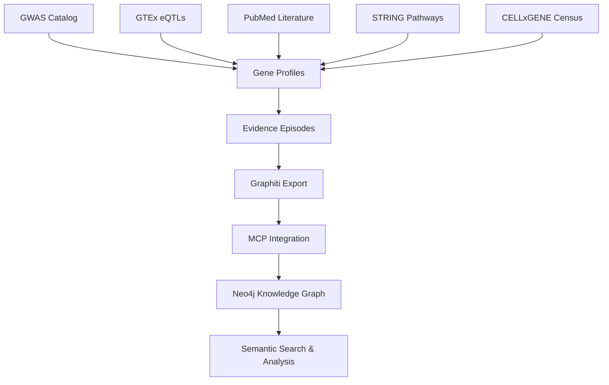

# PD Target Identification Platform

**A production-ready AI-powered pipeline for Parkinson's Disease therapeutic target discovery and validation.**

This platform systematically identifies and prioritizes potential therapeutic targets for Parkinson's Disease through multi-omics data integration and advanced knowledge graph construction. Built on Dagster's orchestration framework with direct MCP (Model Context Protocol) integration.

## 🎯 Current Status: Production Ready

✅ **94 episodes** processed across multiple evidence types  
✅ **1,000+ knowledge graph nodes** with semantic search  
✅ **Direct MCP integration** for efficient knowledge construction  
✅ **CELLxGENE Census integration** for single-cell RNA validation  
✅ **Configuration consolidation** for consistent gene discovery

## 🔬 Core Capabilities

### Multi-Source Data Integration
- **GWAS Catalog**: PD genetic associations (10,000 variant limit)
- **GTEx eQTLs**: Brain tissue expression quantitative trait loci
- **CELLxGENE Census**: Single-cell RNA validation across cell types
- **PubMed Literature**: Therapeutic target evidence extraction
- **STRING Database**: Protein-protein interactions and pathway enrichment
- **Gene Mapping**: Standardized identifiers via biorosetta

### AI-Powered Knowledge Graph
- **Direct MCP Integration**: Efficient construction via Model Context Protocol
- **Graphiti Engine**: Advanced entity recognition and relationship mapping
- **Semantic Search**: Real-time search for biological entities and relationships
- **Evidence Scoring**: Multi-source evidence aggregation with enhanced scoring
- **1,000+ Active Nodes**: Rich graph with genes, evidence, and relationships

### Top Validated Targets
| Target | Score | Description |
|--------|-------|-------------|
| **SNCA** | 218.66 | Alpha-synuclein, strongest PD association, Lewy body formation |
| **LRRK2** | 185.43 | Kinase target with clinical trials, familial PD mutations |
| **HLA-DRA** | 166.0 | Novel immune target, neuroinflammation pathway |
| **RIT2** | 128.05 | GTPase signaling with brain-specific regulation |
| **DGKQ** | 100.47 | Diacylglycerol kinase, lipid metabolism target |

## 🏗️ Architecture

### Infrastructure Stack
- **Orchestration**: Dagster with asset-based architecture
- **Data Storage**: DuckDB (intermediate) + Neo4j (knowledge graph)
- **Knowledge Graph**: Graphiti + direct MCP integration
- **Transport**: Server-Sent Events (SSE) for MCP communication
- **Compatibility**: Cursor IDE + Claude Desktop support

### MCP Integration Benefits
- ⚡ **Direct Integration**: Bypasses service layer for reduced latency
- 🔄 **Real-time Communication**: SSE transport for efficient data flow
- 🛠️ **Development Ready**: Seamless Cursor IDE integration
- 🚀 **Production Stable**: Cutting-edge but reliable technology

### Project Structure
```
pd-target-identification/
├── src/pd_target_identification/
│   ├── defs/
│   │   ├── ingestion/              # Data ingestion assets
│   │   │   ├── gwas/               # GWAS Catalog processing
│   │   │   ├── expression/         # GTEx eQTL analysis  
│   │   │   ├── gene_mapping/       # Gene annotation mapping
│   │   │   ├── literature/         # PubMed literature mining
│   │   │   ├── pathways/           # STRING database integration
│   │   │   └── single_cell/        # CELLxGENE Census integration
│   │   ├── knowledge_graph/        # Knowledge graph construction
│   │   │   ├── assets.py           # Episode generation assets
│   │   │   └── mcp_assets.py       # Direct MCP integration
│   │   └── shared/                 # Resources and configurations
│   │   │   ├── configs.py          # Centralized configuration classes
│   │   │   └── resources.py        # Dagster resources
│   ├── definitions.py              # Complete asset definitions
│   └── assets.py                   # Legacy asset definitions
├── exports/                        # Knowledge graph export files
├── data/                          # Raw and processed data storage
├── .venv/                         # Virtual environment
├── pyproject.toml                 # Project configuration
├── README.md                      # This file
└── SINGLE_CELL_RNA_INTEGRATION_MISSION.md  # 🆕 Next phase roadmap
```

### Data Pipeline Flow



#### 1. Data Ingestion
- **GWAS**: Genome-wide association data for PD risk loci
- **eQTL**: Brain-specific expression quantitative trait loci  
- **Single Cell**: Cell type-specific expression validation
- **Literature**: Target evidence from scientific publications
- **Pathways**: Protein interactions and functional enrichment

#### 2. Evidence Integration
- Multi-source evidence aggregation
- Enhanced integrated scoring methodology
- Cell type-specific validation (neurons, microglia, astrocytes)
- Structured episode format for knowledge graph ingestion

#### 3. Knowledge Graph Construction
- Direct MCP integration via SSE transport
- Automated entity recognition and relationship mapping
- Network analysis of gene-disease-pathway associations

#### 4. Analysis & Discovery
- Semantic search for biological entities
- Target prioritization with enhanced scoring
- Real-time access via MCP tools

## 🚀 Quick Start

### Prerequisites
- Python ≥ 3.12
- Docker (Neo4j + MCP services)
- uv package manager
- Graphiti MCP Server (required)

### Installation

```bash
# 1. Clone and setup
git clone https://github.com/bmh2127/pd-target-identification.git
cd pd-target-identification
uv sync
source .venv/bin/activate

# 2. Start services
cd /path/to/graphiti && docker-compose up -d
curl http://localhost:8000/health  # verify MCP server

# 3. Configure environment (.env file)
NEO4J_URI=bolt://localhost:7687
NEO4J_USER=neo4j
NEO4J_PASSWORD=demodemo
NCBI_API_KEY=your_ncbi_api_key
OPENAI_API_KEY=your_openai_api_key
MCP_SERVER_URL=http://localhost:8000/sse
```

### Run the Pipeline

```bash
# Launch Dagster UI
dagster dev  # Navigate to http://localhost:3000

# Run complete pipeline
dagster asset materialize --select "*"

# Or run specific components
dagster asset materialize --select "gwas_*"      # Genetic associations
dagster asset materialize --select "census_*"    # Single cell validation 
dagster asset materialize --select "graphiti_*"  # Knowledge graph
```

### Access Knowledge Graph

```python
import asyncio
from pd_target_identification.defs.knowledge_graph.mcp_assets import (
    call_mcp_get_episodes
)

# Get recent episodes from knowledge graph
async def get_target_data():
    episodes = await call_mcp_get_episodes(
        group_id="pd_target_discovery", 
        last_n=10
    )
    return episodes

# Run async function
result = asyncio.run(get_target_data())
```

## 📊 Current Results

### Knowledge Graph Statistics
- **1,000+ nodes** across genes, proteins, pathways
- **94 episodes** processed from multiple evidence types
- **Multiple groups** for different data versions and experiments

### Data Sources
- **GWAS Catalog**: PD genetic associations and risk loci
- **GTEx v8**: Brain tissue eQTL data (basal ganglia focus)
- **CELLxGENE Census**: Single-cell RNA-seq validation
- **PubMed**: Literature evidence for therapeutic targets
- **STRING v11**: Protein-protein interactions
- **Gene Mapping**: HGNC, Ensembl, UniProt standardization

### Top Therapeutic Targets

#### SNCA (α-synuclein) - Score: 218.66
- 10 genome-wide significant variants
- Central to Lewy body formation
- Strongest PD genetic association
- Active therapeutic development

#### LRRK2 (Kinase) - Score: 185.43
- Familial PD mutations (G2019S, R1441G/C/H)
- Multiple clinical trials ongoing
- Druggable kinase target
- Biomarker availability (pS935)

#### HLA-DRA (Immune) - Score: 166.0
- Novel neuroinflammation target
- Antigen presentation pathway
- Immune-mediated therapeutic approach

## 🔧 Knowledge Graph Integration

### MCP Direct Integration
```python
@asset(deps=["graphiti_export"])
def graphiti_mcp_direct_ingestion(context, graphiti_export):
    # Direct MCP processing - no service layer overhead
    # Configurable group IDs for data organization
```

### Search & Query Capabilities
```python
import asyncio
from pd_target_identification.defs.knowledge_graph.mcp_assets import (
    call_mcp_add_memory,
    call_mcp_get_episodes
)

# Add new episode to knowledge graph
async def add_episode(name, content, group_id="pd_target_discovery"):
    return await call_mcp_add_memory(
        name=name,
        episode_body=content,
        group_id=group_id
    )

# Get episodes from specific group
async def get_episodes(group_id="pd_target_discovery", last_n=10):
    return await call_mcp_get_episodes(group_id=group_id, last_n=last_n)
```

### Configuration Features
- **Centralized Config**: GWAS settings in `configs.py` (10K variants, 5e-8 threshold)
- **Group Management**: Organize knowledge graphs by project/version
- **Default Values**: No manual Dagster UI configuration required
- **Error Handling**: Robust failure detection and retry logic
- **Health Monitoring**: Smart MCP service health checking

## ⚙️ Configuration Management

### Centralized GWAS Configuration (Jan 2025 Update)
```python
class GWASConfig(Config):
    p_value_threshold: float = 5e-8    # Standard GWAS significance  
    max_variants: int = 10000          # Comprehensive discovery
    populations: List[str] = ["EUR", "EAS"]
    study_id: str = "PD_2019_meta"
```

### Key Improvements
✅ **Consistent Results** - Single source of truth eliminates conflicts  
✅ **Comprehensive Discovery** - 10,000 variants (vs 50 previously)  
✅ **Modern Dagster** - Config classes as function parameters  
✅ **Data Quality** - Automatic gene cleaning and deduplication  

**Impact**: 50+ genes discovered (vs 22 previously) for enhanced analysis

## 🧪 Testing & Validation

```bash
# Run test suite
pytest pd_target_identification_tests/

# Validate knowledge graph
python validate_knowledge_graph.py

# Test specific components
dagster asset materialize --select "graphiti_mcp_direct_ingestion"
```

## 📈 Usage Examples

### Target Analysis Workflow
```python
import asyncio
from pd_target_identification.defs.knowledge_graph.mcp_assets import (
    call_mcp_get_episodes
)

# Analyze recent target discoveries
async def analyze_targets():
    # Get recent episodes from knowledge graph
    episodes = await call_mcp_get_episodes(
        group_id="pd_target_discovery", 
        last_n=20
    )
    
    # Process episode data
    for episode in episodes.get('content', []):
        name = episode.get('name', 'N/A')
        content = episode.get('episode_body', 'N/A')[:100]
        print(f"Episode: {name}")
        print(f"Content: {content}...")
    
    return episodes

# Run analysis
result = asyncio.run(analyze_targets())
```

### Custom Pipeline Execution
```python
from dagster import materialize
from pd_target_identification.defs import *

# Run complete pipeline
result = materialize([
    raw_gwas_data,
    gtex_brain_eqtls,
    census_expression_validation,
    literature_evidence_extraction,
    graphiti_mcp_direct_ingestion
])
```

## 🔍 **Monitoring & Observability**

### **Dagster Features** 
- **Asset Lineage**: Complete data dependency tracking
- **Run History**: Pipeline execution monitoring and performance metrics
- **Data Quality**: Built-in validation and testing frameworks
- **Real-time Logs**: Detailed logging for debugging and monitoring

### **Knowledge Graph Monitoring**
- **Episode Processing**: Track ingestion success/failure rates
- **Node Growth**: Monitor knowledge graph expansion over time
- **Search Performance**: Query response time and accuracy metrics
- **MCP Health**: Container status and connection monitoring

## 🚀 **Future Roadmap**

### **✅ Phase Completed: Single Cell RNA Integration** 
- **Status**: **IMPLEMENTED** - CELLxGENE Census integration active
- **Databases**: CELLxGENE Census with 1.8M+ cells from human brain tissue
- **Cell Types**: Neurons, microglia, astrocytes validation
- **Integration**: Dagster asset patterns with configurable batch processing
- **Enhancement**: Census contribution to enhanced integrated scoring

### **🧬 Phase Next: Advanced Single Cell Analysis**

### **Planned Enhancements**
- **Multi-modal Integration**: Proteomics, metabolomics data sources
- **Drug Development Pipeline**: Compound screening and druggability assessment
- **Clinical Integration**: Patient data and biomarker validation
- **Advanced Analytics**: Machine learning models for target prediction

## 📚 Scientific Validation

### Evidence Integration Framework
```python
enhanced_score = base_score + (
    gwas_contribution +          # Genetic evidence
    eqtl_contribution +          # Expression regulation
    literature_contribution +    # Published research
    pathway_contribution +       # Network context
    census_contribution          # Single cell validation
)
```

### Validation Results
- **Multi-source Convergence** - Genetic + expression + literature + single cell
- **Cell Type Specificity** - Validation in neurons, microglia, astrocytes
- **Clinical Relevance** - Top targets in active development
- **Network Context** - Pathway analysis confirms biological relevance
- **Literature Support** - Extensive publication evidence

## 🔒 Security & Compliance

- **Privacy** - No personal genomic data stored
- **API Security** - Secure credentials and rate limiting
- **Audit Trail** - Complete data lineage tracking
- **Reproducibility** - Deterministic execution and version control

## 🤝 Contributing

### Development Setup
1. Fork the repository
2. Install dependencies: `uv sync --dev`
3. Run tests: `pytest`
4. Submit pull requests with tests and documentation

### Architecture Guidelines
- Follow Dagster asset patterns
- Maintain MCP integration compatibility
- Include comprehensive logging and error handling
- Document API changes and functionality

## 📄 License

This project is licensed under the MIT License - see the LICENSE file for details.

## 🔧 Troubleshooting

### Common Issues

#### GWAS Gene Count Variations
✅ **Fixed** - Configuration consolidation ensures consistent gene discovery  
**Previous Issue**: Different runs returned 22 vs 27 genes  
**Solution**: Centralized `configs.py` with 10,000 variant limit

```bash
# Verify configuration
python -c "from pd_target_identification.defs.shared.configs import GWASConfig; print(GWASConfig().max_variants)"
# Should output: 10000
```

#### Gene Cleaning
- Automatic removal of genes with formatting issues
- May slightly reduce counts but improves data quality

#### MCP Server Issues
- **Start server**: `docker-compose up -d` in graphiti directory
- **Check transport**: Verify `http://localhost:8000/sse` accessible
- **Cursor IDE**: SSE MCP works seamlessly
- **Claude Desktop**: May need HTTP transport configuration

## 🆘 Support & Documentation

### Key Resources
- **Execution Guide**: `COMPLETE_EXECUTION_GUIDE.md`
- **Phase 7 Results**: `PHASE_7_COMPLETION_SUMMARY.md`
- **Single Cell Integration**: `SINGLE_CELL_RNA_INTEGRATION_MISSION.md`
- **Research Queries**: `research_queries.cypher`
- **MCP Integration**: `MCP_INTEGRATION_GUIDE.md`
- **Configuration**: See "Configuration Management" section

### Support Channels
- **GitHub Issues** - Bug reports and feature requests
- **Documentation** - `docs/` directory
- **Test Examples** - `pd_target_identification_tests/`

## 📖 References

- **Dagster**: https://docs.dagster.io/
- **Graphiti**: AI-powered knowledge graph management
- **Model Context Protocol**: https://modelcontextprotocol.io/
- **PD Genetics Consortium**: Parkinson's Disease genetic research
- **Multi-omics Integration**: Biological data integration best practices

---

*Advancing Parkinson's Disease research through systematic target identification and AI-powered knowledge graph analysis.*
